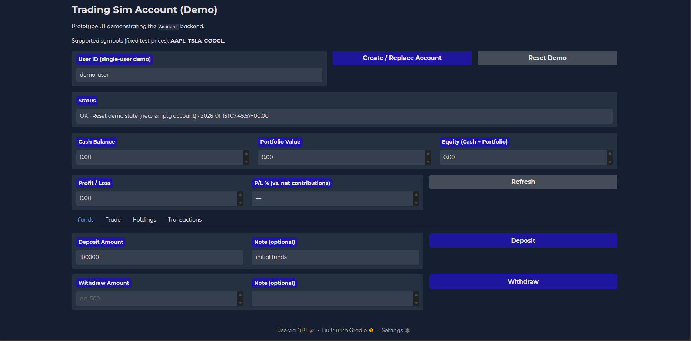

# Engineering Team - AI-Powered Software Development

A sophisticated multi-agent AI system that collaborates to design, develop, test, and deploy software solutions. The team leverages CrewAI to orchestrate specialized agents that work together to transform requirements into production-ready applications.

## 🎯 Project Overview

This project demonstrates an automated software engineering workflow where multiple AI agents work together to build a complete trading simulation account management system. The system processes high-level requirements and produces:

- **Design Documentation**: Detailed architecture and API specifications
- **Backend Implementation**: Production-ready Python modules
- **Frontend UI**: Interactive Gradio applications
- **Test Suite**: Comprehensive unit tests

## 👥 Team of Agents

### 1. **Engineering Lead**
- **Role**: Technical architect and design specification writer
- **Responsibilities**:
  - Analyzes high-level requirements
  - Creates detailed design specifications
  - Defines class and method signatures
  - Ensures modularity and self-containment
- **Model**: GPT-5.1

### 2. **Backend Engineer**
- **Role**: Python implementation specialist
- **Responsibilities**:
  - Implements designs as production-ready code
  - Writes clean, efficient Python modules
  - Follows architectural specifications strictly
  - Ensures code is self-contained and testable
- **Model**: Claude Sonnet 4.5
- **Features**: Code execution enabled with 500s timeout and 3 retry limit

### 3. **Frontend Engineer**
- **Role**: Gradio UI expert
- **Responsibilities**:
  - Develops polished user interfaces
  - Creates production-grade Gradio applications
  - Ensures seamless integration with backend modules
  - Builds intuitive user experiences
- **Model**: Claude Sonnet 4

### 4. **Test Engineer**
- **Role**: Quality assurance and test automation specialist
- **Responsibilities**:
  - Writes comprehensive unit tests
  - Ensures code coverage and reliability
  - Validates backend functionality
  - Creates test modules for validation
- **Model**: Claude Sonnet 4

## 📋 Tasks Workflow

The team executes four coordinated tasks in sequence:

### Task 1: Design Phase
- **Agent**: Engineering Lead
- **Input**: High-level requirements
- **Output**: `{module_name}_design.md` - Detailed design document in Markdown format
- **Description**: Creates architecture blueprint with classes, methods, and functionality descriptions

### Task 2: Implementation Phase
- **Agent**: Backend Engineer
- **Dependencies**: Requires design from Task 1
- **Output**: `{module_name}.py` - Production-ready Python module
- **Description**: Implements the design as clean, executable Python code

### Task 3: Frontend Phase
- **Agent**: Frontend Engineer
- **Dependencies**: Requires implementation from Task 2
- **Output**: `app.py` - Gradio UI application
- **Description**: Creates interactive interface for demonstrating backend functionality

### Task 4: Testing Phase
- **Agent**: Test Engineer
- **Dependencies**: Requires implementation from Task 2
- **Output**: `test_{module_name}.py` - Comprehensive test suite
- **Description**: Generates unit tests for validation and quality assurance

## 📁 Output Files

When the crew execution completes successfully, the following files are generated in the `output/` directory:

```
output/
├── accounts.py                    # Backend module implementing the trading system
├── accounts.py_design.md          # Architectural design and specifications
├── app.py                         # Gradio web application
├── test_accounts.py               # Unit test suite
└── Trading_Simulation_Account_Demo.png  # Application screenshot
```

## 🚀 Getting Started

### Prerequisites
- Python 3.8 or higher
- `uv` package manager installed
- Required dependencies (see `pyproject.toml`)

### Running the Crew

Execute the engineering team to generate all outputs:

```bash
# From the root directory of the project
uv run src/engineering_team/main.py
```

This will:
1. Analyze the requirements for the trading account system
2. Generate detailed design documentation
3. Implement the backend module
4. Create the Gradio UI
5. Generate comprehensive tests
6. Place all files in the `output/` directory

### Launching the Gradio Application

Once the crew has completed execution and generated the `app.py` file:

```bash
# Run the Gradio application
uv run app.py
```

The application will start a local web server (typically at `http://127.0.0.1:7860`) where you can interact with the trading simulation account system.

## 💼 Example Application

The current project implements a **Trading Simulation Account Management System** with the following features:

- **Account Management**: Create accounts, manage user profiles
- **Fund Operations**: Deposit and withdraw funds with balance validation
- **Portfolio Tracking**: Record stock purchases and sales
- **Real-time Valuation**: Calculate portfolio value using current share prices
- **Performance Analytics**: Track profit/loss and return metrics
- **Transaction History**: View complete audit trail of all transactions
- **Risk Management**: Prevent invalid operations (overdrafts, short selling, etc.)
- **Market Integration**: Access to share price data via `get_share_price()` function

### Application Demo



## 🏗️ Project Structure

```
src/engineering_team/
├── main.py                 # Entry point for the crew
├── crew.py                 # Crew configuration and agent definitions
├── helper_utils.py         # Utility functions and configurations
├── README.md               # This file
└── config/
    ├── agents.yaml         # Agent role definitions and backstories
    └── tasks.yaml          # Task descriptions and workflows
```

## 🔧 Configuration

### Agent Configuration (`config/agents.yaml`)
Defines the role, goal, and backstory for each agent in the team. Customize these to modify agent behavior and expertise.

### Task Configuration (`config/tasks.yaml`)
Specifies task descriptions, expected outputs, and dependencies between tasks. Modify to change the workflow or add new tasks.

### LLM Configuration (`crew.py`)
- **Engineering Lead**: GPT-5.1 for architectural decision-making
- **Backend Engineer**: Claude Sonnet 4.5 with code execution enabled
- **Frontend Engineer**: Claude Sonnet 4 for UI development
- **Test Engineer**: Claude Sonnet 4 for quality assurance

## 🎓 How It Works

1. **Requirements Input**: High-level system requirements are provided to the crew
2. **Distributed Processing**: Each agent uses its specialized expertise with its configured LLM
3. **Sequential Collaboration**: Tasks execute in dependency order, with outputs from one task feeding into the next
4. **Output Generation**: All generated artifacts are saved to the `output/` directory
5. **Interactive Testing**: Launch the Gradio app to test the generated system

## 📊 Sample Requirements

The system currently processes requirements for a trading account system, including:

- Account creation and fund management
- Stock trading simulation with buy/sell operations
- Portfolio valuation and performance tracking
- Transaction history and audit trails
- Validation rules to prevent invalid operations
- Integration with market data APIs

## 🛠️ Customization

To use this system for different projects:

1. Edit `src/engineering_team/main.py`
2. Modify the `requirements` variable with your project requirements
3. Update `module_name` and `class_name` if needed
4. Run the crew to generate outputs
5. Launch the resulting application

## 📝 Notes

- The backend engineer has code execution enabled for testing implementations
- All generated Python code is production-ready and fully self-contained
- The Gradio application is designed as a simple prototype/demo
- Generated tests provide comprehensive coverage of the backend module
- All artifacts are available in the `output/` directory after execution

## 🚦 Status

- ✅ Multi-agent team fully operational
- ✅ Design-to-deployment pipeline functional
- ✅ Trading simulation account system implemented
- ✅ Gradio UI available for demonstration
- ✅ Comprehensive test suite generated

## 📧 Support

For issues or questions about the engineering team workflow, refer to the generated design documentation in the `output/` directory or examine the agent configurations in `config/`.

---

**Last Updated**: January 2026
